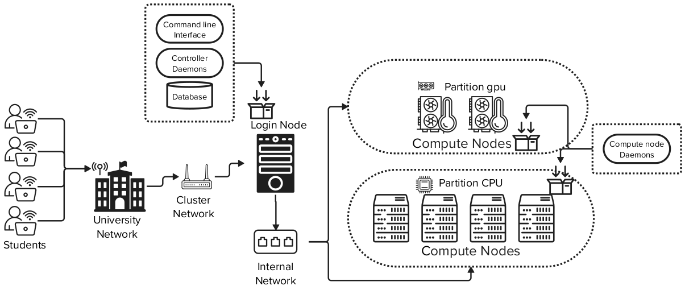

# Cluster Franky

Nosso objetivo é preparar você com as habilidades necessárias para utilizar sistemas de HPC em situações reais. Inspirado no supercomputador Santos Dumont, o Cluster Franky oferece um ambiente robusto e seguro para realizar simulações complexas e análises de grandes volumes de dados.

### Como o Sistema Funciona

Para que você compreenda melhor como o Cluster Franky opera, veja a figura abaixo que detalha a arquitetura do sistema:

#### 1. **Conexão e Autenticação**

O processo de interação com o Cluster Franky começa quando você se conecta ao Cluster via SSH através da rede do Insper, em seguida, você será direcionado ao **Login Node**, que serve como o ponto de entrada para o cluster. Para acessar o sistema, é necessário passar por um processo de autenticação usando pares de chaves públicas e privadas, configurados previamente por nossa equipe técnica.

#### 2. **Envio e Gerenciamento de Tarefas (Jobs)**

Uma vez autenticado, você interage com o cluster através do **Slurm**. O Slurm é responsável por gerenciar a execução das tarefas que você submete, distribuindo-as eficientemente pelos recursos de computação disponíveis, que são divididos em:

- **Nó de Computação CPU:** Composto por cinco nós, cada um com 24 threads e 64 GB de RAM.
- **Nó de Computação GPU:** Composto por um nós, equipado com uma GPU NVIDIA 1080 Ti, 16 GB de RAM e 8 threads.

Os **daemons de controle** cada nó de computação gerencia a execução das tarefas, garantindo que os recursos sejam alocados de forma otimizada. Isso significa que, independentemente de você estar executando simulações simples ou tarefas intensivas de processamento de dados, o sistema está configurado para maximizar a eficiência e minimizar o tempo de execução.

#### 3. **Armazenamento e Gestão de Dados**

Durante suas atividades, você deve utilizar a pasta **SCRATCH** para armazenar temporariamente os arquivos e dados necessários para suas tarefas. É importante lembrar que essa pasta é destinada ao armazenamento temporário, portanto, certifique-se de salvar seus dados em um local seguro após concluir suas atividades.

O sistema de arquivos atual do Cluster Franky utiliza o **NFS (Network File System)**, que facilita o acesso aos dados entre os nós de computação. No futuro, planejamos migrar para o sistema de arquivos **Lustre**, que oferecerá maior eficiência e melhor desempenho no manuseio de grandes volumes de dados.

### Porque usar o Cluster Franky?

Utilizar o Cluster Franky oferece vários benefícios que vão prepará-lo para desafios reais em HPC:

- **Experiência Prática em HPC:** Ao trabalhar com o Cluster Franky, você terá a oportunidade de realizar tarefas que simulam cenários reais encontrados em supercomputadores como o Santos Dumont. Isso inclui a execução de simulações complexas, a otimização de recursos e o uso inteligente das ferramentas disponíveis.

- **Desenvolvimento de Habilidades Técnicas:** Aprender a utilizar ferramentas avançadas como o Slurm e a interagir com ambientes de computação distribuída irá equipá-lo com habilidades técnicas valiosas, amplamente aplicáveis em diversas áreas de pesquisa e indústria.

- **Preparação para o Mundo Real:** A experiência adquirida com o Cluster Franky será um diferencial no mercado de trabalho, pois você estará familiarizado com práticas e tecnologias utilizadas em sistemas de HPC de ponta.

O Cluster Franky não é apenas uma ferramenta de aprendizado; é uma porta de entrada para o mundo da computação de alto desempenho. Aproveite essa oportunidade para expandir seus conhecimentos, experimentar e se preparar para enfrentar desafios de HPC. Se precisar de ajuda ou tiver dúvidas, procure um de nós!
