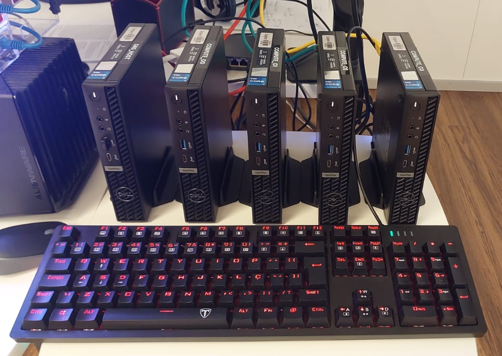

# Contextualizando o HPC

### O que é HPC?

**High-Performance Computing (HPC)** refere-se ao uso de supercomputadores e clusters de computadores para resolver problemas computacionalmente complexos. HPC é essencial em campos como ciência, engenharia e finanças, onde grandes volumes de dados precisam ser processados rapidamente.

### TOP 500

](imgs/img-01.png)

Supercomputador **Fugaku
Fonte:**[https://spectrum.ieee.org/japans-fugaku-supercomputer-is-first-in-the-world-to-simultaneously-top-all-high-performance-benchmarks](https://spectrum.ieee.org/japans-fugaku-supercomputer-is-first-in-the-world-to-simultaneously-top-all-high-performance-benchmarks)

O [**TOP 500**](https://top500.org/) é uma lista semestral que classifica os 500 supercomputadores mais poderosos do mundo com base no benchmark LINPACK, que mede a capacidade de resolver sistemas de equações lineares. A lista é um indicador importante do progresso em tecnologia de supercomputação. Variações da lista incluem:

- [**Green500**](https://top500.org/lists/green500/): Classifica supercomputadores pela eficiência energética.
- [**Graph500**](https://graph500.org/): Mede o desempenho em tarefas de análise de gráficos.
- [**HPCG**](https://top500.org/lists/hpcg/): Avalia supercomputadores usando um benchmark alternativo ao LINPACK, mais representativo de cargas de trabalho reais em HPC.

### Que tipo de problema é computacionalmente complexo?

Problemas computacionalmente complexos exigem grande capacidade de processamento e memória para serem resolvidos eficientemente. Exemplos incluem:

- Simulações climáticas
- Modelagem molecular
- Processamento de grandes conjuntos de dados (Big Data)
- Análise genômica
- Renderização de gráficos em alta resolução
- Aprendizado de máquina e inteligência artificial

### O que é um supercomputador?

](imgs/img-03.png)

Monstrão - Supercomputador do Insper
Fonte:[https://www.insper.edu.br/noticias/conhece-o-monstrao-saiba-mais-sobre-o-supercomputador-do-insper/](https://www.insper.edu.br/noticias/conhece-o-monstrao-saiba-mais-sobre-o-supercomputador-do-insper/)

Um **supercomputador** é um sistema computacional de alto desempenho projetado para processar grandes volumes de dados e realizar cálculos complexos muito rapidamente. Ele consiste em milhares de nós de computação interconectados, cada um contendo múltiplos processadores, grande quantidade de memória e armazenamento rápido.

### O que é um Cluster?

Cluster Franky - Laboratório de Redes e Supercomputação do Insper

Um **cluster** é um conjunto de computadores (nós) conectados que trabalham juntos como se fossem um único sistema. Cada nó em um cluster é um computador independente, mas o sistema inteiro é gerenciado para atuar em conjunto, distribuindo tarefas e compartilhando recursos.

### Qual a diferença de um supercomputador para um cluster?

A principal diferença entre um **supercomputador** e um **cluster** está na integração e desempenho:

- **Supercomputador**: Um sistema integrado de alto desempenho projetado especificamente para computação intensa. Possui uma arquitetura otimizada e interconexões de alta velocidade.
- **Cluster**: São computadores independentes conectados para trabalhar juntos. Pode ser composto por hardware de mercado e geralmente é mais flexível e expansível.

OBS: Muitos supercomputadores modernos são de fato clusters, utilizando milhares de nós interconectados para alcançar um desempenho extremamente alto.

### O que é preciso saber para utilizar o Cluster?

Para utilizar um cluster eficientemente, é importante entender:

- **Acesso e Conexão**: Como se conectar ao cluster e configurar as credenciais de acesso.
- **Gerenciamento de Recursos**: Como usar o sistema de gerenciamento de SLURM para submeter e monitorar jobs.
- **Sistema de Arquivos**: Navegação e uso do sistema de arquivos do cluster.
- **Compilação e Execução**: Compilar código e executar programas no ambiente do cluster.
- **Paralelização**: Como paralelizar código usando bibliotecas como OpenMP e MPI.

### O que é preciso saber para resolver problemas em HPC?

Para resolver problemas em HPC, é essencial ter conhecimento em:

- **Arquitetura de Computadores**: Compreender a arquitetura do sistema, incluindo hierarquia de memória e caches, para escrever código eficiente.
- **Otimização de Código**: Técnicas de otimização, uso eficiente da memória, uso eficiênte do compilador.
- **Profiling**: Ferramentas e técnicas para identificar gargalos de desempenho e medir a eficiência do código.
- **Gerenciamento de Recursos**: Usar ferramentas de gerenciamento como SLURM para alocar recursos adequadamente.
- **Programação Paralela**: Usar OpenMP para paralelização em memória compartilhada e MPI para memória distribuída.

### Recursos Adicionais

- **Documentação do SLURM**: [SLURM User Guide](https://slurm.schedmd.com/documentation.html)
- **Tutoriais de MPI**: [MPI Tutorial](https://mpitutorial.com/)
- **OpenMP**: [OpenMP Official Site](https://www.openmp.org/)
- **Profiling Tools**: [Gprof](https://ftp.gnu.org/old-gnu/Manuals/gprof-2.9.1/html_mono/gprof.html), [Valgrind](http://valgrind.org/)