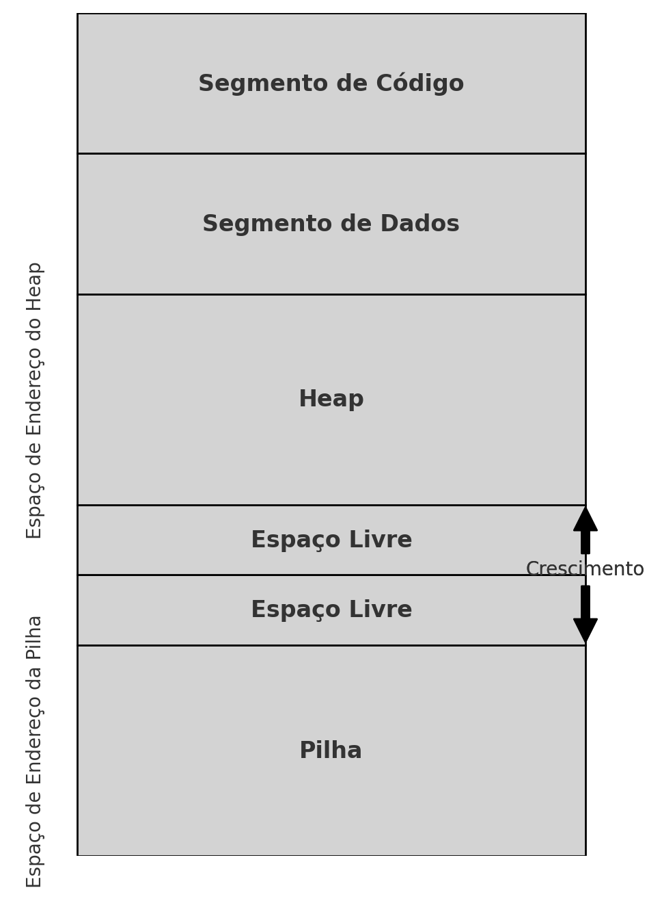
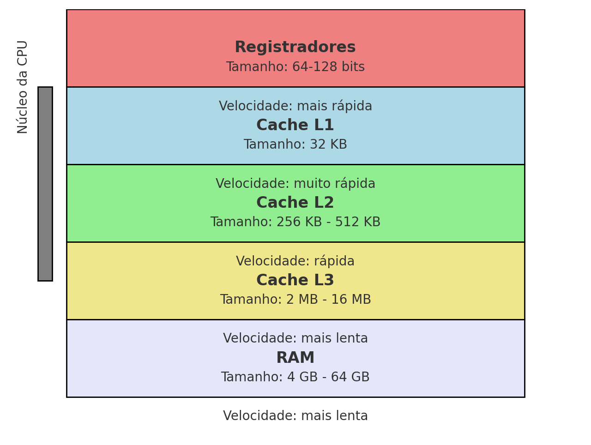
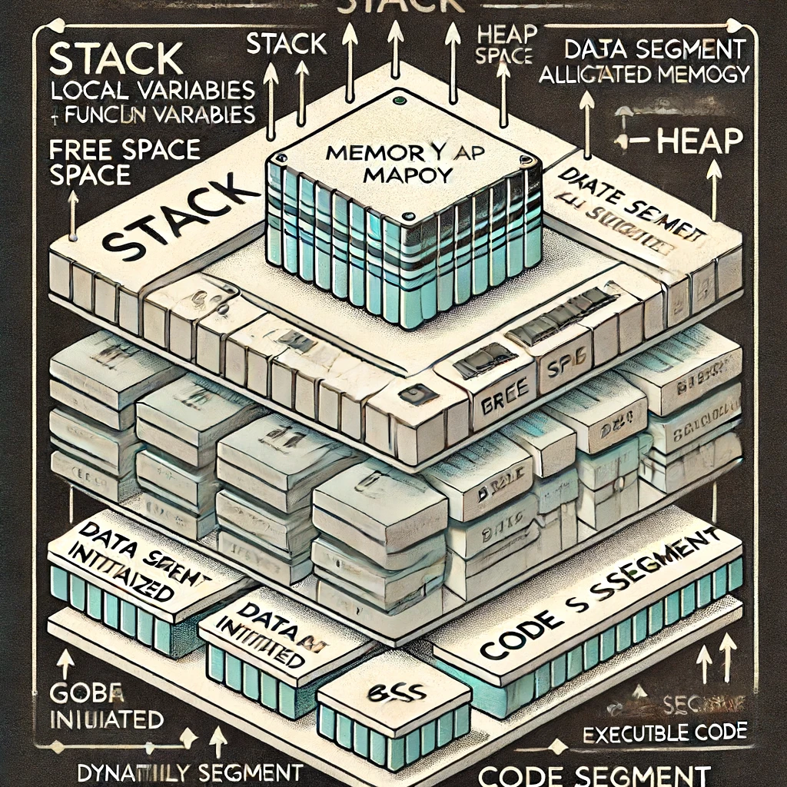

# Relembrando conceitos importantes

O mapa de memória de um computador revela como a memória é organizada e gerenciada, isso é essencial para entender o armazenamento, o acesso e a manipulação de dados pela CPU. A memória principal do sistema inclui o heap, a stack e os segmentos de dados e código. 

1. **Pilha:** Localizada no topo do mapa de memória, é usada para armazenar variáveis locais e chamadas de função. Cada thread possui sua própria pilha.
2. **Espaço Livre:** Espaço entre a pilha e o heap, permitindo o crescimento de ambos conforme necessário.
3. **Heap:** Área usada para a alocação de memória dinâmica. Memória é alocada e desalocada conforme necessário durante a execução do programa.
4. **Segmento de Dados:** Contém variáveis globais e estáticas. Este segmento é dividido em duas partes:
    - **Segmento de Dados Inicializado:** Armazena variáveis globais e estáticas que são inicializadas.
    - **BSS (Block Started by Symbol):** Armazena variáveis globais e estáticas não inicializadas.
5. **Segmento de Código:** Contém o código executável do programa.

Os endereços da pilha crescem de cima para baixo, enquanto os endereços do heap crescem de baixo para cima, conforme indicado pelas setas de crescimento no diagrama. Essa organização é essencial para o gerenciamento eficiente da memória e para garantir a integridade e desempenho do programa

Os caches, subdivididos em L1, L2 e L3, são memórias rápidas de diferentes tamanhos e velocidades. O L1 é o mais rápido e menor, localizado dentro do núcleo da CPU. O L2 é maior e mais lento que o L1, mas ainda mais rápido que a RAM, enquanto o L3, compartilhado entre os núcleos do processador, é maior e mais lento que o L2. Os registradores, pequenas quantidades de memória dentro da CPU, são extremamente rápidos e usados para operações imediatas e temporárias.

- **Registradores:** Pequenas quantidades de memória dentro da CPU, extremamente rápidas, usadas para operações imediatas e temporárias. Tamanho: 64-128 bits.
- **Cache L1:** O cache mais rápido e muito pequeno, localizado dentro do núcleo da CPU. Tamanho: 32 KB.
- **Cache L2:** Maior e mais lento que o L1, mas ainda muito rápido. Tamanho: 256 KB - 512 KB.
- **Cache L3:** Compartilhado entre os núcleos do processador, é maior e mais lento que o L2, mas ainda mais rápido que a RAM. Tamanho: 2 MB - 16 MB.
- **RAM:** A memória principal do sistema, maior em tamanho e a mais lenta em termos de velocidade comparada aos caches e registradores. Tamanho: 4 GB - 64 GB ou mais.

No contexto de HPC, escolher os tipos de dados adequados em C++ é crucial por várias razões. 

- Variáveis menores ocupam menos espaço, permitindo que mais dados sejam armazenados no cache ou na RAM, melhorando a localidade de cache e resultando em acessos mais rápidos.
- A velocidade de processamento também é impactada pela escolha dos tipos na declaração da variável. A CPU processa tipos menores mais rapidamente, e instruções SIMD (Single Instruction, Multiple Data) podem processar múltiplos dados em paralelo se os tipos forem pequenos o suficiente para caberem nos registradores.
- A precisão dos cálculos é outra consideração importante. Para cálculos científicos, a precisão adicional dos `double` pode ser necessária para evitar erros numéricos significativos, enquanto em gráficos e outras aplicações, `float` pode ser suficiente e mais eficiente em termos de memória e processamento.
- Usar tipos menores de variáveis reduzem a quantidade de dados transferidos entre nós em um cluster, diminuindo a latência e a sobrecarga de comunicação.

Considerar corretamente os tipos na criação das variáveis é importante para maximizar a eficiência de uso de memória, melhorar a velocidade e a precisão dos cálculos, otimizar o desempenho computacional, minimizar a fragmentação de memória, aproveitar melhor o paralelismo e reduzir a latência de comunicação, além de melhorar a localidade de cache e o acesso à memória. Compreender o mapa de memória do computador e como os diferentes tipos de dados interagem com a CPU e a memória pode levar a melhorias significativas no desempenho dos seus algoritmos.