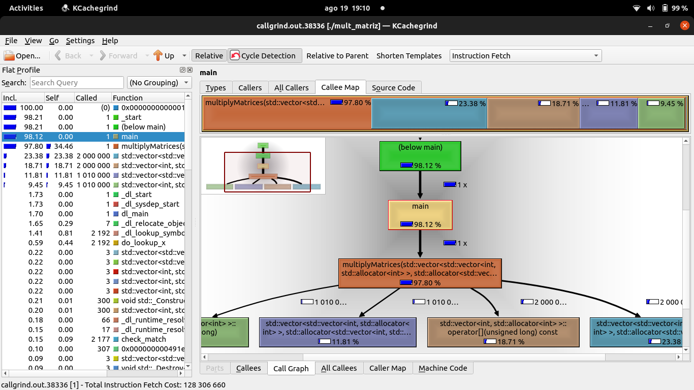

# Profiling 

Profiling é o processo de medir o comportamento de um programa em termos de consumo de recursos, como tempo de execução, uso de CPU, memória e I/O. As informações coletadas durante o profiling ajudam a identificar "gargalos" ou partes do código que são ineficientes.

!!! tip "Use o Cluster Franky"
        Acessando o terminal dele via ssh com o comando ssh nome_da_pasta@ip_do_cluster
        
        
[ficou com dúvida?](../aulas/01-introducao/index.md)
### Ferramentas para Profiling em C++

**gprof:** O gprof (GNU Profiler) é uma ferramenta de profiling que faz parte do GNU Compiler Collection (GCC). Ele é usado para medir o tempo de execução gasto em cada função de um programa e criar um relatório detalhado de como esse tempo é distribuído entre as várias partes do código. O gprof é útil para identificar "gargalos" de desempenho em um programa, onde otimizações podem ser mais eficazes.
    
**Valgrind:** O Valgrind é uma suíte de ferramentas que ajuda a encontrar bugs de memória e a realizar profiling de programas,também é usado para medir o desempenho do programa em termos de uso de CPU.
    
    

### Exemplo 1: Usando `gprof` 

Vamos começar com um exemplo básico de como usar o `gprof`.

#### Código de Exemplo em C++

O código exemplo *mult_matriz.cpp* realiza uma operação de multiplicação de matrizes. Ele multiplica duas matrizes  **A**  e  **B**  e armazena o resultado na matriz **C**.


```cpp
#include <iostream>
#include <vector>

void multiplyMatrices(const std::vector<std::vector<int>>& A, const std::vector<std::vector<int>>& B, std::vector<std::vector<int>>& C) {
    int n = A.size();
    for (int i = 0; i < n; ++i) {
        for (int j = 0; j < n; ++j) {
            C[i][j] = 0;
            for (int k = 0; k < n; ++k) {
                C[i][j] += A[i][k] * B[k][j];
            }
        }
    }
}

int main() {
    int n = 100;
    std::vector<std::vector<int>> A(n, std::vector<int>(n, 1));
    std::vector<std::vector<int>> B(n, std::vector<int>(n, 2));
    std::vector<std::vector<int>> C(n, std::vector<int>(n, 0));

    multiplyMatrices(A, B, C);

    std::cout << "Matrix multiplication completed." << std::endl;
    return 0;
}
```

#### Compilação com Suporte a Profiling

Para usar o `gprof`, precisamos compilar o código com a flag `-pg`, que habilita o suporte ao profiling:

```bash
g++ -pg mult_matriz.cpp -o mult_matriz
```

#### Executando o Programa

Depois de compilar, execute o programa normalmente:

```bash
./mult_matriz
```

Essa execução vai gerar um arquivo chamado `gmon.out`, que contém os dados de profiling.

#### Analisando os Dados com `gprof`

Agora, use o `gprof` para analisar os dados:

```bash
gprof mult_matriz gmon.out > analise.txt
```

Isso cria um relatório detalhado do tempo gasto em cada função e a quantidade de chamadas feitas. O relatório será salvo no arquivo `analise.txt`.

#### Entendendo o Relatório de Profiling

Após executar o seu programa com `gprof`, você obterá um relatório que contém duas seções principais: o **Flat Profile** e o **Call Graph**. Vamos explorar o significado de cada uma e como interpretá-las.

#### Flat Profile: Identificando as Funções Críticas

O **Flat Profile** fornece uma visão geral do tempo que cada função consome durante a execução do programa. Aqui estão os principais elementos do relatório:

- **% time**: Indica a porcentagem do tempo total de execução que foi gasto em cada função. Funções com valores mais altos são geralmente os principais alvos para otimização.

- **cumulative seconds**: É o tempo acumulado até essa função ser chamada. Ele ajuda a entender quanto tempo foi gasto no programa até aquele ponto.

- **self seconds**: É ao tempo gasto exclusivamente dentro da função, sem incluir o tempo das funções que ela chama.

- **calls**: Mostra quantas vezes a função foi chamada. Funções chamadas muitas vezes podem ser boas candidatas para otimização, especialmente se tiverem um tempo significativo por chamada.

- **self ms/call** e **total ms/call**: Esses valores mostram o tempo médio gasto em cada chamada da função. `self ms/call` é o tempo gasto na própria função, enquanto `total ms/call` inclui o tempo das funções que ela invoca.

#### Call Graph: Compreendendo as Relações Entre Funções

O **Call Graph** mostra a hierarquia de chamadas entre as funções do seu programa. Ele detalha como as funções estão interconectadas e qual o impacto de cada uma no tempo de execução total.

- **Self/Children Time**: O tempo "Self" é o gasto na própria função, enquanto o tempo "Children" é o gasto nas funções que ela chama.

- **Called**: Informa quantas vezes uma função foi chamada, seja diretamente ou indiretamente por outras funções.

### Análise do Relatório de Profiling

No relatório gerado, as funções relacionadas ao operador `operator[]` do `std::vector` aparecem como críticas, consumindo cerca de **33%** do tempo de execução cada. Isso indica que a maneira como os vetores são acessados e manipulados no código esta consumindo bastante tempo.

Além disso, a função **`multiplyMatrices`** aparece com um tempo de execução acumulado considerável. Como esta função realiza o trabalho pesado da multiplicação de matrizes, é natural que ela seja um foco de atenção para otimização.

#### Oportunidades de Otimização

Com base no relatório, os possíveis candidatos a otimização são:

- **Reduzir Acessos ao Vetor**: Como o acesso aos elementos do vetor (`operator[]`) consome uma parte significativa do tempo de execução, podemos tentar reduzir o número de acessos diretos ao vetor. 

- **Otimizar a Função `multiplyMatrices`**: Esta função é o coração do processamento e qualquer melhoria aqui terá um grande impacto no desempenho global. Podemos pensar em paralelizar a função para distribuir o trabalho entre múltiplos núcleos ou máquinas, em um ambiente HPC como o Cluster Franky.


### Exemplo 2: Usando Valgrind para Profiling de Memória

O **Valgrind** tem um conjunto de ferramentas para análise de programas. Uma de suas funcionalidades mais conhecidas é a detecção de problemas de memória, mas também pode ser usado para profiling de CPU.

Vamos usar o mesmo código de multiplicação de matrizes do exemplo anterior.

#### Usando o Valgrind para Detectar Problemas de Memória

Primeiro, compile o código normalmente, sem flags especiais:

```bash
g++ mult_matriz.cpp -o mult_matriz
```

Agora, execute o programa usando o **Valgrind** para detectar problemas de memória:

```bash
valgrind --leak-check=full ./mult_matriz &>leak-check.txt

```

O Valgrind irá executar o programa e relatar quaisquer vazamentos de memória ou acessos inválidos no arquivo leak-check.txt.

No relatório obtido aqui nos meus testes eu tive os seguintes resultados:

### Interpretação do Relatório Valgrind

1. **HEAP SUMMARY (Resumo da Pilha)**
   - **in use at exit: 0 bytes in 0 blocks**: Isso significa que, ao final da execução do programa, não há blocos de memória alocados que não foram liberados. Ou seja, toda a memória que foi alocada foi devidamente liberada.
   
   - **total heap usage: 308 allocs, 308 frees, 202,128 bytes allocated**: Este campo indica que, ao longo da execução do programa, 308 alocações de memória *heap* ocorreram, e todas as 308 foram correspondidas por uma liberação. O total de memória alocada durante o programa foi de 202,128 bytes.

2. **All heap blocks were freed -- no leaks are possible**
   - Esta linha confirma que todos os blocos de memória foram liberados corretamente, portanto, não há vazamentos de memória possíveis. Isso significa que o gerenciamento de memória no programa está sendo feito corretamente.

3. **ERROR SUMMARY: 0 errors from 0 contexts (suppressed: 0 from 0)**
   - Esta parte do relatório informa que não houve nenhum erro de memória detectado. Isso inclui erros como acessos inválidos, uso de memória não inicializada, ou acessos fora dos limites. O Valgrind não encontrou nenhum problema relacionado à memória neste programa.


#### Usando o Valgrind para Profiling de CPU com `callgrind`

O Valgrind também pode ser usado para profiling de CPU com a ferramenta **Callgrind**:

```bash
valgrind --tool=callgrind ./mult_matriz 
```

Este comando vai resultar em um arquivo de saída `callgrind.out.<PID>`, que contém informações detalhadas sobre o uso da CPU por cada função do programa.


O relatório que você executou com Callgrind fornece um resumo sobre o desempenho do programa em termos de **instruções executadas**. Os elementos principais do relatório são:

1. **Events: Ir**: **`Ir`** significa "Instruction References". Este evento conta o número total de instruções de máquina que foram executadas pelo programa. As instruções de máquina são as operações mais básicas que a CPU realiza, como somar números, carregar dados da memória, ou comparar valores. No relatório aqui do meu teste, o valor de `Ir` é **128,306,660**. Isso significa que o programa executou mais de 128 milhões de instruções durante a multiplicação de matrizes.

2. **Collected: 128,306,660**: Este número indica que o Callgrind coletou dados sobre todas essas 128 milhões de instruções. É uma confirmação de que todas as instruções executadas foram monitoradas.

3. **I refs: 128,306,660** : **`I refs`** é uma métrica que mostra o número total de referências de instrução que foram feitas durante a execução do programa. Como o valor é igual ao de `Ir`, isso indica que cada instrução foi contabilizada.


O que fazer com essas informações?

- **Número de Instruções**: Um alto número de instruções (`Ir`) pode indicar que o programa está realizando muitas operações. Em um ambiente HPC, isso pode ser bom ou ruim, dependendo da eficiência dessas instruções. Muitas instruções simples podem ser rápidas, enquanto poucas instruções complexas podem ser mais lentas.

- **Identificação de Gargalos**: Ao combinar esses dados com outras informações, como tempos de execução e cache misses (que Callgrind também pode monitorar), você pode identificar quais partes do código consomem mais recursos e otimizar essas áreas. Por exemplo, se uma função específica estiver gerando um grande número de instruções e utilizando muito cache, ela pode ser um gargalo que precisa ser otimizado.

### Próximos Passos

Para uma análise mais detalhada, você pode:

Usar o **KCachegrind** (uma interface gráfica) para visualizar o resultado detalhadamente:

```bash
kcachegrind callgrind.out.<PID>
```



Como podemos ver na imagem, a função **`multiplyMatrices`** está destacada em laranja e consome **97.80%** do total de instruções. Isso indica que a multiplicação de matrizes é a operação mais intensiva e crítica em termos de desempenho no código. Como essa função domina o uso de CPU, ela é o principal alvo para otimização.

As funções que manipulam `std::vector` também aparecem com destaque:

**`std::vector::operator[]`**: Consome **18.71%** das instruções. Esse operador é chamado cada vez que um elemento do vetor é acessado. A alta porcentagem indica que muitos acessos ao vetor estão ocorrendo, o que pode ser um ponto de otimização.
     
**`std::vector::allocator`**: Também está destacada, indicando que a alocação e acesso aos elementos do vetor é um fator importante no uso de recursos.

### Comparação entre Gprof e Valgrind

**Gprof** e **Valgrind** são ferramentas de profiling, mas com focos e funcionalidades especificas. Na tabela temos uma comparação detalhada entre essas duas ferramentas:

| **Aspecto**            | **Gprof**                                                                 | **Valgrind**                                                                            |
|------------------------|---------------------------------------------------------------------------|-----------------------------------------------------------------------------------------|
| **Foco Principal**     | Profiling de desempenho, medindo o tempo gasto em funções.                 | Detecta erros de uso de memória e oferece ferramentas de profiling. |
| **Uso Típico**         | Mapear gargalos de desempenho e identificar o tempo de execução das funções. | Detectar vazamentos de memória, acessos inválidos, e mapear o uso de CPU e memória.    |
| **Complexidade**       | Relativamente simples de usar e interpretar, adequado para profiling inicial. | Mais complexo, com várias ferramentas especializadas para diferentes tipos de análise.   |
| **Overhead de Execução**| Baixo overhead; o programa roda quase na velocidade normal.                | Alto overhead; o programa pode rodar significativamente mais lento devido à análise detalhada. |
| **Análise de Funções**  | Oferece relatórios de chamadas (Call Graph) e perfis de funções para entender o tempo de execução. | Oferece gráficos de chamadas detalhados com Callgrind, além de perfis de cache e instruções. |
| **Depuração de Memória**| Não fornece suporte para debug de memória.                            | Ferramenta principal para depuração de memória, com suporte para detectar vazamentos e erros. |
| **Multithreading**      | Suporta análise básica, mas não é especializado em detectar race conditions. | Helgrind é especializado race conditions em programas multithreaded. |
| **Integração e Uso**   | Parte do GCC, fácil de integrar em fluxos de trabalho de compilação.      | Requer execução com a ferramenta específica e pode necessitar de ajustes no ambiente para uso eficiente. |
| **Ambiente de Uso**    | Ideal para profiling em ambientes de desenvolvimento e produção.           | Melhor utilizado em desenvolvimento e testes devido ao overhead; útil em produção para análise pontual. |

### Conclusão

**Gprof** e **Valgrind** são ferramentas complementares no arsenal de um desenvolvedor:

- **Gprof** é uma boa escolha quando o objetivo é entender a distribuição de tempo de execução entre as funções de um programa. Com seu baixo overhead, é ideal para profiling inicial e para identificar rapidamente as áreas do código que mais consomem tempo.

- **Valgrind** é indispensável quando se trata de garantir o bom funcionamento do código, especialmente em relação ao uso de memória. Embora introduza um overhead significativo, suas ferramentas como **Memcheck** e **Callgrind** são essenciais para detectar vazamentos de memória, acessos inválidos, e para visualizar o desempenho em termos de uso de CPU e cache.

Em ambientes de HPC, usar **Gprof** para identificar gargalos de desempenho e **Valgrind** para garantir que o código esteja livre de erros de memória e bem otimizado, proporciona uma abordagem robusta para garantir que o software seja tanto rápido quanto confiável. 