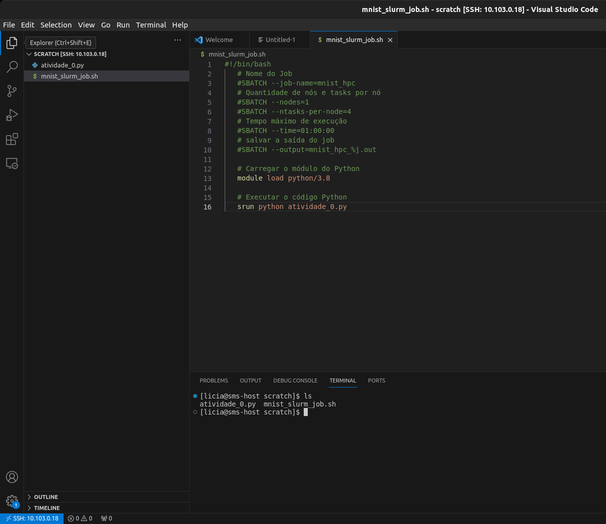

# **Aula 02: Acessando o Cluster Franky**

Na Atividade 2, você irá executar as implementações que foram testadas na Atividade 1, mas agora no ambiente de um cluster HPC usando SLURM. O objetivo é observar como o ambiente de cluster, com sua capacidade de processamento paralelo, pode impactar o desempenho das operações computacionalmente intensivas que você já explorou.

### **Parte 0: Configurando seu acesso ao Cluster Franky**

Para ter acesso ao Cluster Franky você precisa configurar suas credenciais de acesso e realizar acesso remoto via SSH.

Entre no Blackboard, navegue até a seção de materiais do curso onde a pasta com o par de chaves foi disponibilizada, Faça o download da pasta completa, que contém os arquivos `id_rsa` (chave privada) e `id_rsa.pub` (chave pública). Dependendo do sistema operacional que você utiliza, siga as instruções abaixo para configurar  corretamente sua chave privada.

#### **Para Macbook ou Linux:**

Abra o terminal, navegue até a pasta onde a chave privada (`id_rsa`) foi baixada, mova a chave para o diretório `.ssh` em sua home:

```bash
mv id_rsa ~/.ssh/
```

Garanta que apenas você possa ler o arquivo:

```bash
chmod 600 ~/.ssh/id_rsa
```

Conecte-se ao cluster utilizando o comando SSH:

Substitua `nome_da_pasta` pelo nome que está na pasta com as chaves que você baixou no BlackBoard e `cluster_endereco` pelo endereço de IP fornecido durante a aula.


```bash
ssh -i ~/.ssh/id_rsa nome_da_pasta@ip_do_cluster
```
ou

```bash
ssh nome_da_pasta@ip_do_cluster
```


#### **Para Windows:**

**Usando OpenSSH :**

Abra o PowerShell ou Windows Terminal. Navegue até a pasta onde a chave privada (`id_rsa`) foi baixada, mova a chave para a pasta `.ssh` em seu diretório de usuário:

```powershell
mkdir $env:USERPROFILE\.ssh
mv id_rsa $env:USERPROFILE\.ssh\
```

Certifique-se de que as permissões estão corretas:
```powershell
icacls $env:USERPROFILE\.ssh\id_rsa /inheritance:r /grant:r "$($env:USERNAME):(R)"
```
Conecte-se ao cluster usando o comando:
```powershell
ssh -i $env:USERPROFILE\.ssh\id_rsa seu_usuario_insper@ip_do_cluster
```

### Configurar o VS Code para Acesso Remoto ao Cluster**

**Instale a Extensão Remote - SSH**:

Abra o VS Code, vá para a aba de extensões (ícone de quadrado no lado esquerdo). Pesquise por "Remote - SSH" e instale a extensão oficial da Microsoft.

**Configurar o Acesso Remoto**:

Pressione `Ctrl+Shift+P` (ou `Cmd+Shift+P` no Mac) para abrir o painel de comandos.

Digite `Remote-SSH: Add New SSH Host...` e selecione a opção.

Insira o comando SSH que você utilizou anteriormente:
```bash
ssh -i ~/.ssh/id_rsa nome_da_pasta@ip_do_cluster
```
Escolha o arquivo de configuração padrão (`~/.ssh/config` para Mac/Linux ou `C:\Users\seu_usuario\.ssh\config` para Windows).

Pressione `Ctrl+Shift+P` (ou `Cmd+Shift+P` no Mac) novamente e digite `Remote-SSH: Connect to Host...`. Selecione o host configurado.

O VS Code abrirá uma nova janela conectada ao ambiente remoto do cluster.



**Gerenciar Projetos Remotamente**:

 Após a conexão, você pode abrir pastas e arquivos no cluster diretamente pelo VS Code.

 Utilize os recursos do VS Code, como o terminal integrado e o debug para trabalhar no cluster Franky.


###  Executando a Atividade 0 no Cluster Franky usando SLURM

Um arquivo .slurm é usado para "lançar jobs" no sistema SLURM, especificando os recursos necessários para a execução, como memória, número de máquinas e núcleos. Nesse arquivo, também definimos como desejamos o output do executável e onde o sistema pode encontrar o arquivo a ser executado. Como a equipe que gerencia o Cluster definiu que os jobs sejam lançados apenas da pasta SCRATCH, podemos omitir o caminho do arquivo nos nossos arquivos .slurm.

!!! warning
      As instruções #SBATCH são tecnicamente consideradas "comentários" pelo interpretador de comandos do shell (bash), mas não são realmente ignoradas. Quando você escreve um script para ser executado pelo SLURM, o bash interpreta as linhas #SBATCH como comentários normais, enquanto o gerenciador de jobs SLURM interpreta essas mesmas linhas como diretivas que definem como o job deve ser executado.

!!! tip 
      Não é necessário neste momento, mas se você quiser transferir arquivos da sua máquina para o cluster e vice versa, você pode usar o comando scp [mais detalhes aqui](../../Teoria/comandos-ssh.md)


Crie um script de submissão .slurm para cada implementação utilizando os exemplos abaixo. Esse script será utilizado para enviar o job ao cluster.

**Script SLURM para o código em Python:**

matriz_mult_python.slurm

```bash
#!/bin/bash
#As instruções SBATCH não devem ser descomentadas

#SBATCH --job-name=mult_matriz_py
# define o nome do job. Esse nome aparece nas listas de jobs e é útil para identificar o job.

#SBATCH --output=mult_matriz_py.out
# Especifica o arquivo onde a saída padrão (stdout) do job será salva.

#SBATCH --ntasks=1
# Define o número de tarefas que o job executará. Neste caso, o job executa uma única tarefa.

#SBATCH --time=00:10:00
# Define o tempo máximo de execução para o job. Neste caso, o job tem um tempo limite de 10 minutos. Se o job exceder esse tempo, ele será automaticamente encerrado.

#SBATCH --partition=normal
# Especifica a partição (ou fila) onde o job será submetido. Aqui, o job será submetido a fila "normal".

python3 mult_matriz_py.py
#Executa o programa python3 dentro do nó de computação.
```

**Script SLURM para arquivos C++:**

Como o C++ é uma linguagem que requer compilação, precisamos gerar o executável antes de preparar o arquivo .slurm.

Dentro da pasta SCRATCH, compile seu código .cpp para gerar o binário.

```c++
g++  mult_matriz_cpp.cpp -o mult_matriz_cpp 
```


matriz_mult_cpp.slurm

```bash
#!/bin/bash
#SBATCH --job-name=matriz_mult_cpp
# Define o nome do job como "matrix_mult_openmp". Esse nome aparece nas listas de jobs e é útil para identificar o job.

#SBATCH --output=matriz_mult_cpp.out
# Especifica o arquivo onde a saída padrão (stdout) do job será salva.

#SBATCH --ntasks=1
# Define o número de tarefas que o job executará. Neste caso, o job executa uma única tarefa.

#SBATCH --time=00:10:00
# Define o tempo máximo de execução para o job. Neste caso, o job tem um tempo limite de 10 minutos. Se o job exceder esse tempo, ele será automaticamente encerrado.

#SBATCH --partition=normal
# Especifica a partição (ou fila) onde o job será submetido. Aqui, o job será submetido a fila "normal".


./mult_matriz_cpp
# Executa o programa compilado "mult_matriz_cpp" dentro do nó de computação.

```


**Script SLURM para arquivos C++ com Paralelismo:**

Ao utilizar o OpenMP para paralelizar códigos em C++, é necessário incluir a flag apropriada durante a compilação. Essa flag informa ao compilador para interpretar corretamente as diretivas OpenMP no código e gerar o binário de forma adequada.

```c++
g++ -fopenmp mult_matriz_paralelo -o mult_matriz_paralelo.cpp
```

matriz_mult_paralelo.slurm

```bash
#!/bin/bash

#SBATCH --job-name=matriz_mult_paralelo
# Define o nome do job como "matrix_mult_paralelo". Esse nome aparece nas listas de jobs e é útil para identificar o job.

#SBATCH --output=matriz_mult_paralelo.out
# Especifica o arquivo onde a saída padrão (stdout) do job será salva.

#SBATCH --ntasks=1
# Define o número de tarefas que o job executará. Neste caso, o job executa uma única tarefa.

#SBATCH --cpus-per-task=4
# Especifica o número de CPUs que devem ser alocadas para esta tarefa.

#SBATCH --time=00:10:00
# Define o tempo máximo de execução para o job. Neste caso, o job tem um tempo limite de 10 minutos. Se o job exceder esse tempo, ele será automaticamente encerrado.

#SBATCH --partition=normal
# Especifica a partição (ou fila) onde o job será submetido. Aqui, o job será submetido a fila "normal".


./mult_matriz_paralelo
# Executa o programa compilado "mult_matriz_paralelo" dentro do nó de computação.

```

### **Parte 2: Execução das Implementações no Cluster**

**Submissão dos Jobs:**

Utilize o comando `sbatch` para submeter cada script SLURM ao cluster.

**Exemplo:**

```bash
sbatch matriz_mult_python.slurm
sbatch matriz_mult_cpp.slurm
sbatch matriz_mult_paralelo.slurm
```

**Monitoramento dos Jobs:**

Use o comando `squeue` para monitorar o status dos jobs.

**Exemplo:**

```bash
squeue 
```

**Análise dos Resultados:**

Após a execução dos jobs, os resultados estarão disponíveis nos arquivos `.out`  especificados em cada script SLURM.

  - Compare os tempos de execução dos três métodos (Python, C++, C++ com OpenMP) no cluster.

   - Analise como o paralelismo afeta o desempenho no ambiente do cluster, em comparação com sua execução local.

!!! tip 
      Se quiser explorar mais os comandos do SLURM, [temos uma material aqui que pode te ajudar](../../Teoria/slurm.md)


**Entrega Atividade 2 - Relatório de Desempenho:**
   
   - Prepare um relatório detalhado, incluindo gráficos que mostrem a relação entre o tamanho das matrizes e o tempo de execução para cada implementação.
 
   - Discuta o impacto do ambiente HPC no desempenho das operações e como o paralelismo pode escalar em um cluster de múltiplos nós.

   - Submeta seu relatório pelo Blackboard até as 23h59 do dia da aula.


Nesta atividade, você explorou como o ambiente de cluster, pode ser utilizado para otimizar e acelerar operações que são intensivas em termos computacionais. Isso oferece uma base sólida para entender como tarefas de grande escala, como o processamento de big data ou o treinamento de modelos de IA, podem ser significativamente aceleradas com HPC.


