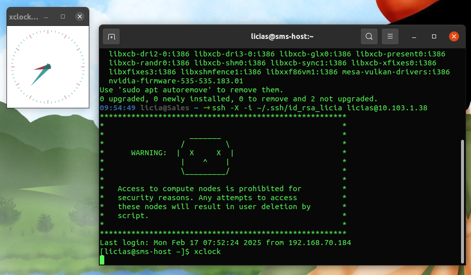

# Otimização e Profiling 
Em ambientes de HPC, dominar técnicas de otimização e profiling pode fazer toda a diferença na execução de programas complexos. Nosso objetivo é capacitar você a identificar gargalos de desempenho em seu código. 

**Objetivo:** Entender como utilizar as flags de compilação e ferramentas de profiling para encontrar gargalos e melhorar o desempenho do código.

**Recursos Necessários:**

- Código base do programa de convolução (`convolucao.cpp`) usado na [aula 02](../02-slurm/index.md).

- Ferramentas de profiling: `gprof`, `Valgrind`.
  
- Se você estiver usando Windows, será necessário habilitar o X11 para exibir a interface gráfica do cluster. Há diversos tutoriais disponíveis online, [recomendo esse aqui](https://www.ibm.com/support/pages/system/files/inline-files/Using%20Putty%20with%20Xming%20X11%20Forwarding%20from%20Windows%20to%20display%20a%20remote%20IBM%20MQ%20Explorer%20in%20Linux.pdf) 


### Configuração e Teste do X11 nos Principais Sistemas Operacionais

#### Linux
- **Instale um servidor X (se necessário):**
  ```bash
  sudo apt install x11-apps xauth  # Debian/Ubuntu
  sudo dnf install xorg-x11-xauth  # Fedora/RHEL
  ```
- **Conecte-se ao cluster com X11 Forwarding:**
  ```bash
   ssh -X -i ~/.ssh/id_rsa seu_usuario@ip_do_cluster
  ```
- **Teste a exibição gráfica:**
  ```bash
  xclock
  ```

#### macOS
- **Instale o XQuartz** (servidor X para macOS):
  ```bash
  brew install --cask xquartz
  ```
  Depois de instalar, abra o XQuartz e rode:
  ```bash
  xhost +
  ```
- **Conecte-se ao cluster com SSH e X11 Forwarding:**
  ```bash
    ssh -X -i ~/.ssh/id_rsa seu_usuario@ip_do_cluster
 ```
- **Teste a exibição gráfica:**
  ```bash
  xclock
  ```

#### **Windows**

Siga o tutorial para configurar o PuTTY, depois, vá até **Connection > SSH > X11** e marque **"Enable X11 Forwarding"** antes de conectar.

- **Teste a exibição gráfica:**
  ```bash
  xclock
  ```

### Para conectar ao Cluster com X11 Forwarding e Testar a Configuração

Após configurar o **X11 Forwarding**, conecte-se ao cluster utilizando a flag `-X` ou `-Y` no comando SSH:

```bash
ssh -X -i ~/.ssh/id_rsa seu_usuario@ip_do_cluster

```
Se houver problemas com `-X`, tente com `-Y`, que permite conexões X11 menos restritivas:
```bash
ssh -Y -i ~/.ssh/id_rsa seu_usuario@ip_do_cluster
```

### Verificando se o X11 está Funcionando

Após conectar ao cluster via SSH, execute o seguinte comando para verificar se o display foi corretamente encaminhado:

```bash
echo $DISPLAY
```
- **Se o retorno for algo como `localhost:10.0`**, significa que o X11 Forwarding está ativo.  
- **Se o retorno for vazio**, pode ser necessário revisar a configuração.

Agora, teste a exibição de uma aplicação gráfica simples no cluster:

```bash
xclock
```
Se a configuração estiver correta, um relógio gráfico será exibido na tela do seu computador.


Se o **X11 Forwarding** estiver corretamente configurado, o teste com `xclock` abrirá uma janela gráfica no seu computador. Se houver falhas, verifique se o servidor X está rodando na sua máquina local.



Após concluir as configurações, vamos retornar ao guia. Começaremos explorando as flags de compilação que o GCC oferece para otimizar seu código. Desde ajustes básicos até transformações avançadas, você verá como as diferentes flags podem impactar o desempenho de seu programa.

Após otimizar o código na compilação, vamos entender como as ferramentas de profiling Gprof e Valgrind funcionam. Essas ferramentas são úteis para identificar quais partes do código são as mais exigentes em termos de recursos e onde os maiores ganhos de desempenho podem ser alcançados.

#### Flags de Compilação
- **`-O1`**: Nível básico de otimização que aplica melhorias simples, mantendo o tempo de compilação rápido.
- **`-O2`**: Aplicação de otimizações mais agressivas, incluindo inlining de funções simples, unrolling de loops, e remoção de código morto.
- **`-O3`**: Nível mais alto de otimização, inclui todas as otimizações do `-O2` além de transformações adicionais que podem aumentar ainda mais o desempenho, como a vectorização de loops.
- **`-march=native`**: Gera código otimizado para a arquitetura específica da máquina onde o programa está sendo compilado, aproveitando ao máximo as instruções da CPU disponível.

#### Compilação com Diferentes Flags
1. Compile o programa `convolucao.cpp` com diferentes níveis de otimização:

Sem otimização:
```bash
mpic++ convolucao.cpp -o convolucao_basicao
```

Otimização básica (`-O1`):
```bash
mpic++ -O1 convolucao.cpp -o convolucao_O1
```
Otimização padrão (`-O2`):
```bash
mpic++ -O2 convolucao.cpp -o convolucao_O2
```
Otimização avançada (`-O3`):
```bash
mpic++ -O3 -march=native convolucao.cpp -o convolucao_O3
```

#### Medição de Desempenho

1. Execute cada versão do programa no cluster usando um script SLURM similar ao usado na aula 02.

Modifique o número de iterações para **10, 30, e 60** para avaliar o impacto da complexidade no tempo de execução, submeta os jobs via SLURM, verifique os tempos de execução e compare o impacto de cada nível de otimização.

#### Análise dos Resultados

**Gráficos**: Elabore gráficos que relacionam o tempo de execução com o número de iterações para cada nível de otimização.
**Discussão**: Analise como as diferentes flags de otimização impactaram o desempenho. Identifique quais otimizações trouxeram maiores ganhos e em quais situações.

### Profiling com Gprof e Valgrind

#### Usando o Gprof
Compile o código com suporte ao Gprof:

```bash
mpic++ -pg -O2 convolucao.cpp -o convolucao_gprof
```
Execute o programa e gere o perfil:

```bash
sbatch convolucao_gprof.slurm
```
Analise o `gmon.out` gerado:

```bash
gprof convolucao_gprof gmon.out > analysis_gprof.txt
```

Interprete o **Flat Profile** e o **Call Graph** gerados. Identifique as funções críticas e discuta possíveis otimizações com base nos resultados.

#### Usando o Callgrind (Valgrind)

Execute o programa com o Callgrind:

```bash
valgrind --tool=callgrind ./convolucao_O2
```

Para visualizar o relatório via terminal use o comando:

```bash
callgrind_annotate callgrind.out.<pid>
```

```bash
kcachegrind callgrind.out.*
```
Analise o uso de CPU e cache. Identifique funções e loops que são candidatos para otimização.
Compare as saídas do **gprof** e **Callgrind**. 

### Profiling

**Elabore um Relatório que inclua:** 

   - Gráficos e análise dos tempos de execução para diferentes otimizações.

   - Discussão sobre os resultados obtidos com o **gprof** e **Callgrind**.

   - Sugestões de otimizações adicionais baseadas nos resultados de profiling.

**Submissão**: Envie o relatório pelo Classroom até 24/02, 23h59.
