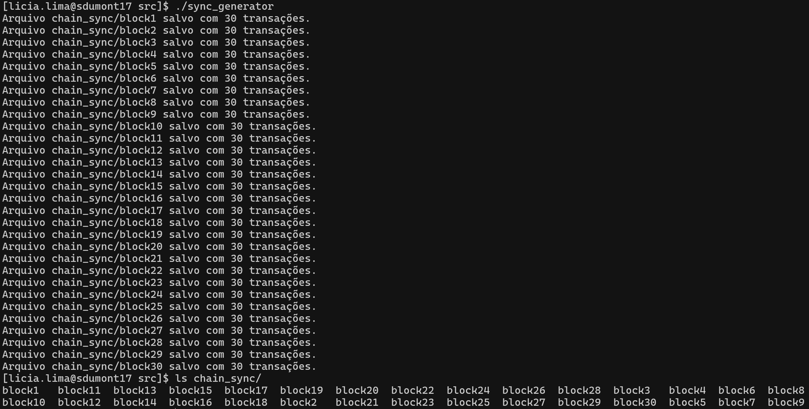
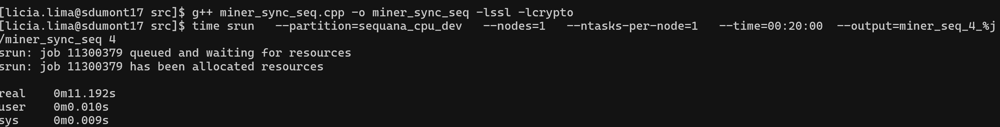
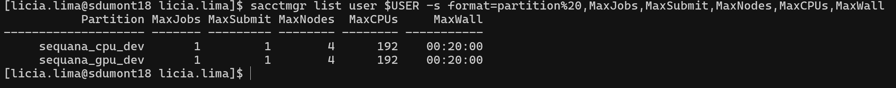

# **Mineração de criptomoedas**

A mineração surgiu com o **Bitcoin**, criado por *Satoshi Nakamoto* em 2008. A proposta era descentralizar o controle do dinheiro, permitindo que qualquer pessoa pudesse participar da validação das transações em uma rede pública.

A validação é feita por meio de um **algoritmo de consenso** chamado **Proof of Work (PoW)**. A PoW exige que os nós da rede (os *mineradores*) resolvam um problema matemático difícil — e quem resolve primeiro, tem o direito de adicionar um novo bloco à blockchain e receber uma recompensa.

Essa “prova” é feita através de um processo chamado de **hashing**, e no caso do Bitcoin, utiliza o algoritmo **SHA-256**.

##  **O que é SHA-256**

**SHA-256** é parte da família de funções de hash **SHA-2**, desenvolvida pela Agência de Segurança Nacional dos Estados Unidos (NSA) em 2001.  
SHA significa *Secure Hash Algorithm*.

### Características principais:
- Gera uma saída de **256 bits** (64 caracteres hexadecimais)
- É uma função **determinística**: mesma entrada, mesma saída
- É **unidirecional**: não dá para "voltar" da saída para a entrada
- Pequenas mudanças na entrada resultam em mudanças drásticas na saída (efeito avalanche)
- Altamente sensível à **colisões** (duas entradas diferentes que dão a mesma saída são indesejáveis)


##  **Como o SHA-256 funciona?**

SHA-256 funciona em blocos de **512 bits de entrada**, que passam por várias etapas:

1. **Pré-processamento**:
   - *Padding*: a mensagem é estendida até múltiplos de 512 bits.
   - *Parsing*: a mensagem é dividida em blocos de 512 bits.
   - *Inicialização*: 8 variáveis de 32 bits com constantes iniciais (derivadas da raiz quadrada dos primeiros 8 primos).

2. **Função de compressão**:
   - Cada bloco de 512 bits passa por **64 rodadas** de operações bit a bit (AND, OR, XOR, ROTR, etc).
   - Usa uma tabela de **64 constantes** (derivadas da raiz cúbica dos primeiros 64 primos).
   - A cada rodada, as variáveis são atualizadas com funções não lineares.

3. **Concatenação final**:
   - Após todos os blocos processados, os 8 valores de 32 bits são concatenados e formam o **hash final de 256 bits**.


##  **Mineração com SHA-256: o que acontece?**

O minerador tenta encontrar um valor chamado **nonce** que, quando combinado com o cabeçalho do bloco e passado pelo SHA-256 duas vezes (**double SHA-256**), resulta em um hash menor que o alvo definido pela **dificuldade da rede**.

Ou seja, o minerador está basicamente **tentando encontrar um número (nonce)** que leve o hash a começar com **N zeros**.

## **Por que é um problema de HPC?**

A mineração é um problema de **busca exaustiva**. Os mineradores testam **bilhões de nonces por segundo**. A performance da mineração depende da capacidade de realizar **SHA-256 o mais rápido possível**.

Por trás da idéia de "minerar bitcoins", existe um problema computacional intensivo, cuja solução depende de capacidade de processamento, eficiência do código e uso inteligente dos recursos de hardware.

Então, o que a mineração tem a ver com HPC?

Simples: a mineração de criptomoedas é um problema clássico de HPC moderno, por envolver:

    Busca exaustiva de soluções (nonces)

    Processamento paralelo de dados

    Uso de algoritmos de hash otimizados (SHA-256)

    Aproveitamento de CPU, GPU e clusters

para entender com mais detalhes como SHA-256 se relaciona com um sistema de criptomoedas, [assista o vídeo](https://www.youtube.com/watch?v=bBC-nXj3Ng4). Vamos ao projeto...

Acesse o seu repositório do projeto via [GitHub Classromm](https://classroom.github.com/a/0ZkvaM9D)

# Projeto - Minerador de Hashes

Este projeto é um minerador de hashes em **C++** que simula um processo de **proof-of-work** usado na mineração de criptomoedas. O código permite a **busca de um hash válida** a partir de transações lidas de arquivos e a tentativa de encontrar um **nonce correto** para gerar um hash que atenda a um critério de dificuldade.

No repositório tem três implementações prontas:

- Um minerador **sequencial** de transações **síncronas**
- Um gerador de **transações síncronas**, com 30 transações fixas.
- Um gerador de **transações assíncronas**, com quantidade e intervalo de transações aleatórios.

### Para executar o gerador de transações síncronas:

Se você estiver em um ambiente HPC, carregue os módulos

```cpp
# Se estiver no SDumont
module load gcc/12.4.0_sequana
```

Compile o código e gere o binário:

```cpp
 g++ sync_generator.cpp -o sync_generator -lssl -lcrypto
```

Execute o binário:

```cpp
./sync_generator
```

Você deve ter uma saída parecida com essa:



O conteúdo de cada bloco é:

```cpp
ID: tx_1
Timestamp: 2025-03-28 11:24:55
Conteúdo: txcVfYs819MPNETO9zPS
Hash: 435a03ab073f14a6f80591affbfde6b98d1945de0749e633f1e2c9ff34f8b06d
...
...
...
ID: tx_30
Timestamp: 2025-03-28 11:24:55
Conteúdo: w5sNqOPnBNm4iwnQeXS3
Hash: c96958b686b92597528f3666e56963b62194a4bdaa2ecee3329f4f6c47fb577c

```

### Para o gerador de transações assíncronas, siga o mesmo processo com o código async_generator.cpp

### Para realizar a mineração sequêncial

Garanta que os módulos estão carregados:

```cpp
# Se estiver no SDumont
module load gcc/12.4.0_sequana
```

Compile o código e gere o binário:

```cpp
g++ miner_sync_seq.cpp -o miner_sync_seq -lssl -lcrypto
```

Execute o binário via srun, o comando abaixo solicita ao slurm:

- 1 CPU,
- 1 tarefa por CPU,
- por 20 minutos (tempo máximo disponível na fila sequana_cpu_dev),
- salva o output em miner_seq_4_código_do_job
- Executa o miner_seq com 4 zeros a esquerda

```cpp
time srun   --partition=sequana_cpu_dev   --nodes=1   --ntasks-per-node=1   --time=00:20:00  --output=miner_seq_5_%j   .
/miner_seq 4
```

Você deve ver algo parecido com:



E dentro do arquivo de output:


Se você der o comando no terminal do SDumont:

```cpp
sacctmgr list user $USER -s format=partition%20,MaxJobs,MaxSubmit,MaxNodes,MaxCPUs,MaxWall
```

Terá acesso aos recursos habilitados para uso com o seu login:



## **Critérios de Avaliação**

### **Rubrica D**

- Executa o código minerador síncrono, no cluster **Franky**
    - Com dificuldade **5 zeros,  com pelo menos 5 gerações diferentes de sync_gen**
- Gera relatório com explicação, tempo de execução e recursos SLURM utilizados

### **Rubrica D+**

- Cumpre todos os requisitos da Rubrica D
- Com dificuldade **7 zeros , com pelo menos 5 gerações diferentes de sync_gen**
- Gera relatório com explicação, tempo de execução e recursos SLURM utilizados

### Rúbrica C

- Executa o código minerador **assíncrono**, no cluster **SDumont**
- Com dificuldade **5 zeros, com pelo menos 5 gerações diferentes de async_gen**
- Gera relatório com explicação, tempos de execução e recursos SLURM utilizados

### **Rubrica B**

- Executa o código minerador **assíncrono**, no cluster **SDumont**
- Com dificuldade **6 zeros, com pelo menos 5 gerações diferentes de async_gen**
- Usa pelo pelo menos uma estratégia de otimização **em CPU** (MPI e OpenMP) no código.
- Gera relatório com explicação, tempos de execução e recursos SLURM utilizados
- Explica diferenças de execução, desempenho e configurações entre os ambientes

### **Rubrica B+**

- Cumpre todos os requisitos da Rubrica B
- Usa as duas estratégias de otimização, MPI e OpenMP

### **Rubrica A**

- Executa o código minerador **assíncrono**, no cluster **SDumont**
- Com dificuldade **7 zeros, com pelo menos 5 gerações diferentes de async_gen**
- Realiza a mineração em **GPU**.
- Gera relatório com explicação, tempos de execução e recursos SLURM utilizados
- Explica diferenças de execução, desempenho e configurações entre os ambientes

### **Rubrica A+**

- Cumpre todos os requisitos da Rubrica A
- Usa uma estratégia de otimização híbrida, partes do código paralelizado em CPU, partes do código em GPU.
- Apresenta **análise comparativa** completa entre as estratégias de otimização, ambientes e arquiteturas.

## **📌 Entregáveis**

[GitHub-Classroom](https://classroom.github.com/a/0ZkvaM9D) contendo:

- Implementações
- Scripts SLURM utilizados
- Evidências (prints, logs, etc..)
- Relatório técnico contendo:
    
    - Explicação do funcionamento do código
    
    - Tempo de execução
    
    - Estratégias computacionais utilizadas (CPU/GPU, etc.)
    
    - Discussão sobre os recursos solicitados via SLURM
    
    - Comparação entre ambientes
